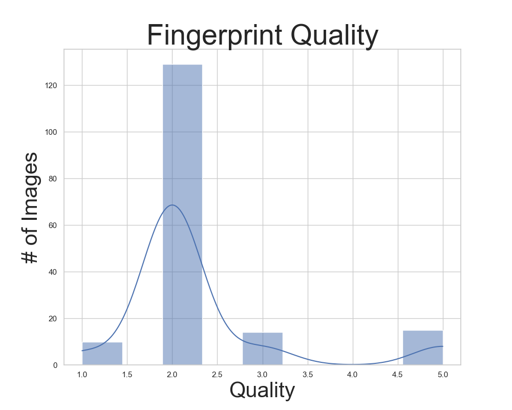
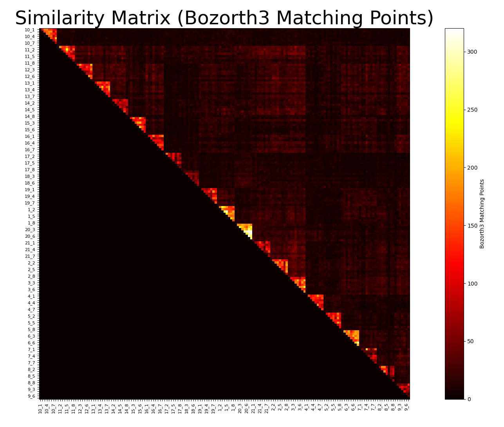

# Image Based Biometry
This repository contains the materials for the IBB class assignments.

## Assignment 1 - Fingerprint Recognition
In this assignment, we performed fingerprint recognition using the NBIS toolkit, combined with simple classification methods for recognizing different fingerprints.

### Links
[Report](assignments/01_fingerprint_recognition/report.pdf) \
[Source code](assignments/01_fingerprint_recognition/solution.py)

### Figures

